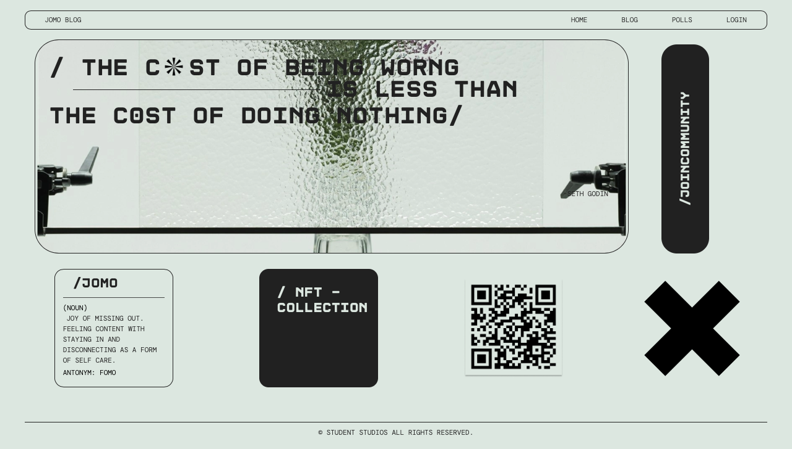

# Django Blog application

## About The Project




This is a a django blog, create blog posts. Engage with your community/audience with polls. Users must sign up and login in order to participate in polls. 

### Built With

[![Django Version][django-badge]][django-url]
[![Bootstrap][Bootstrap.com]][Bootstrap-url]


## Running the Application

### Using venv

1. Clone the repository:
   ```bash
   git clone https://github.com/axe-0/blog.git

1.1 Create a virtual environment (if not already created):

      A) use pipn ormally when installing packages

            > python -m pip install pip

      B) nstall package to enable virtual envirment 

                > pip install virtualenv

1.2 Activate the virtual environment:
  On macOS and Linux:
    
      source venv/bin/activate

  On Windows:

    .\venv\Scripts\activate


1.3 Navigate into hyperion/ and Install project dependencies:

    pip install -r requirements.txt
    
1.4 Run the development server:

    python manage.py runserver
    
1.5 Access the application in your web browser at http://localhost:8000/

### Using Docker 

2.1 Pull image from docker hub:

    docker pull axe0/jomo-blog:latest

    
2.2 Run the Docker container:

    docker run -it -p 8000:8000 axe0/jomo-blog:latest


2.3 Access the application in your web browser at http://localhost:8000/

### Security Keys 

  security configurations for this application can be found in the 'security_config.txt' file in the dropbox. 

  Enter these in the settings.py file where you see the following :

    #ADD Key from 'security_config.txt' here:
    SECRET_KEY = ""


## Usage

Use the admin panel to create blog posts.

1. Create a super user by running the following in the root     directory :

    python manage.py createsuperuser

2. Login with your super user credentials to the admin panel by going to the folowing path http://localhost:8000/admin

3. You can create posts and pollss by selecting add next to posts and polls 


Users can sign up and login in, read the blog post and interact with posts and other community content.


### License


[](https://opensource.org/licenses/MIT)

For the full text of the MIT License, please visit [opensource.org/licenses/MIT](https://opensource.org/licenses/MIT).


<!-- MARKDOWN LINKS & IMAGES -->
[django-badge]: https://img.shields.io/badge/Django-3.2-green.svg
[django-url]: https://www.djangoproject.com/


[Bootstrap.com]: https://img.shields.io/badge/Bootstrap-563D7C?style=for-the-badge&logo=bootstrap&logoColor=white
[Bootstrap-url]: https://getbootstrap.com

